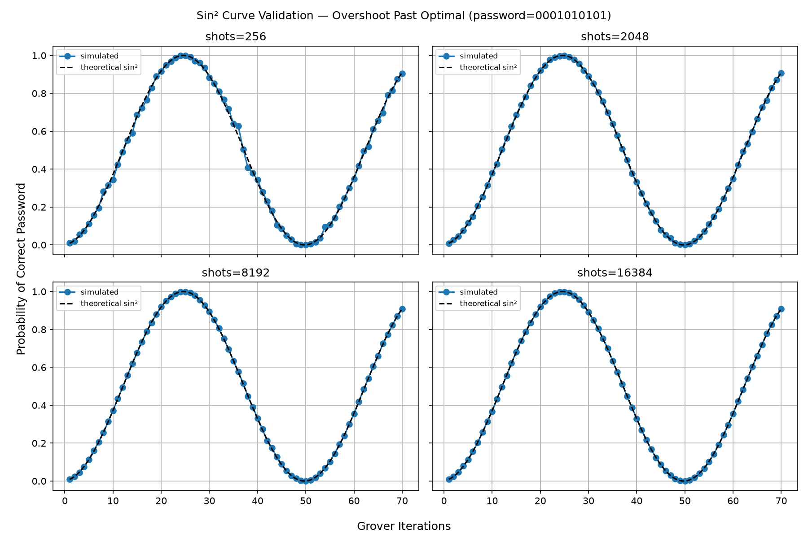
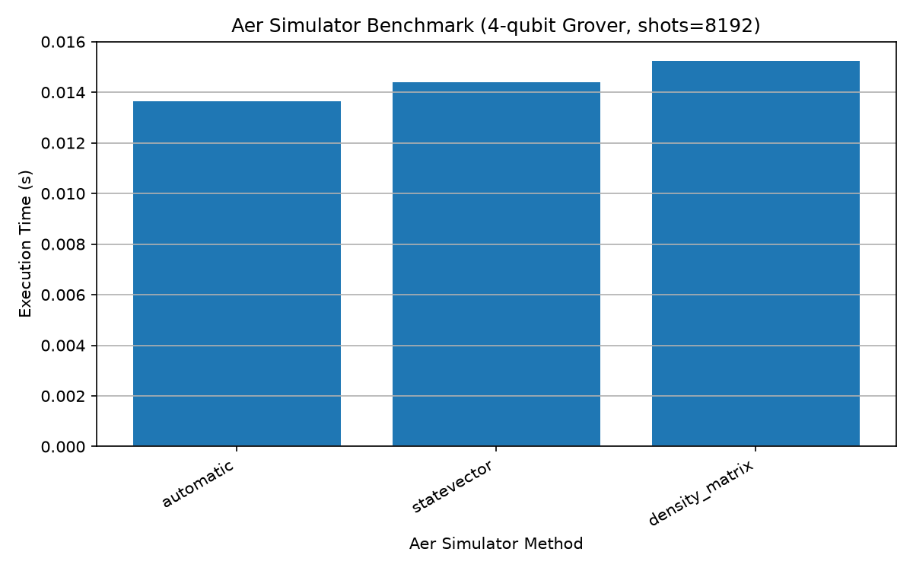
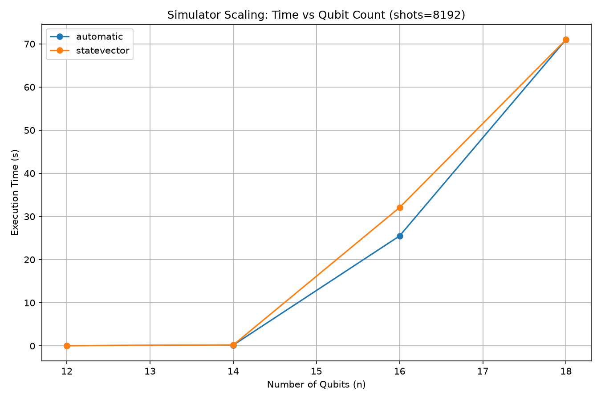

# Grover's Algorithm — Simulator Performance & Sin² Validation

An implementation of Grover's search algorithm in Qiskit, extended with
three experiments: (1) validating the theoretical sin² amplitude curve
against simulation, (2) how Aer simulator methods compare at fixed qubit
count, and (3) how execution time scales with qubit count.

## What this is

Standard Grover's search (oracle + diffuser, optimal iteration count via
`floor((pi/4) * sqrt(2^n))`), split across two files:

- `grovers.py` — the core algorithm, a single-run demo, and two
  benchmarking experiments (simulator method comparison, scaling with n)
- `sin_squared_validation.py` — a focused experiment that deliberately
  overshoots the optimal iteration count to trace out Grover's full
  theoretical probability curve, and checks how closely simulation
  tracks theory at different shot counts

## Key findings

### 1. Sin² curve validation (over-rotation)

Grover's algorithm's success probability follows a theoretical curve:

```
P(k) = sin²((2k + 1) · θ),  where θ = arcsin(1/√(2^n))
```

Running well past the optimal iteration count (rather than stopping at
the textbook-recommended point) traces out the full oscillation —
probability rises to a peak, then falls back down as the algorithm
"over-rotates" past the correct answer, then rises again.



- All shot counts (256, 2048, 8192, 16384) correctly reproduce the
  theoretical sin² shape, including the peak (~iteration 25, P≈1.0) and
  trough (~iteration 50, P≈0) for this 10-qubit password.
- **256 shots is the only count with visible deviation from theory** —
  noticeable wobble on the rising/falling edges. 2048 shots and above
  are visually indistinguishable from the theoretical curve.
- Practical takeaway: for this circuit size, ~2048 shots is enough to
  reliably track the true probability curve; fewer shots trade accuracy
  for speed in a way that's visible, not just theoretical.

### 2. Simulator method comparison (fixed n=4)



At small qubit count, `automatic`, `statevector`, and `density_matrix`
all complete in ~15ms — no meaningful difference yet. The real gap only
shows up once qubit count increases (see below).

### 3. Scaling: execution time vs qubit count



| n  | `automatic` / `statevector` | `density_matrix` |
|----|------------------------------|-------------------|
| 4  | ~0.015s                     | ~0.015s           |
| 8  | ~0.02s                      | ~0.77s            |
| 10 | ~0.02s                      | **~126s**         |
| 14 | ~0.2s                       | not tested (too slow) |
| 16 | **~25-32s**                 | not tested         |
| 18 | **~71s**                    | not tested         |

- `statevector`/`automatic` stay near-instant up to ~14 qubits, then hit
  the expected exponential wall — visible from n=16 (25-32s) to n=18
  (~71s), consistent with O(2^n) state vector scaling.
- `density_matrix` blows up far earlier: ~1000x slower than statevector
  already by n=10, consistent with its O(4^n) scaling.
- `unitary`, `superop`, `extended_stabilizer`, and `matrix_product_state`
  either hang or fail outright on this circuit — likely because the
  multi-controlled-X gates in the oracle/diffuser aren't Clifford
  operations, and these methods don't suit measured circuits with this
  gate structure. Not yet root-caused in depth.

## How to run

```bash
uv sync

# core algorithm + benchmarks
uv run python grovers.py

# sin² curve validation (separate script)
uv run python sin_squared_validation.py
```

## Known limitations / next steps

- `unitary`/`superop`/`extended_stabilizer`/`matrix_product_state`
  failure modes not yet diagnosed — worth checking whether they behave
  differently on unmeasured circuits (`grover_circuit(password, measure=False)`).
- Scaling data stops at n=18 (statevector) and n=10 (density_matrix) —
  extrapolation beyond that is inferred from trend, not measured.
- No noise model / real hardware run included yet — IBM Quantum Open
  Plan access (real QPU) is available and is the natural next step, to
  compare ideal simulator predictions against actual hardware noise.
